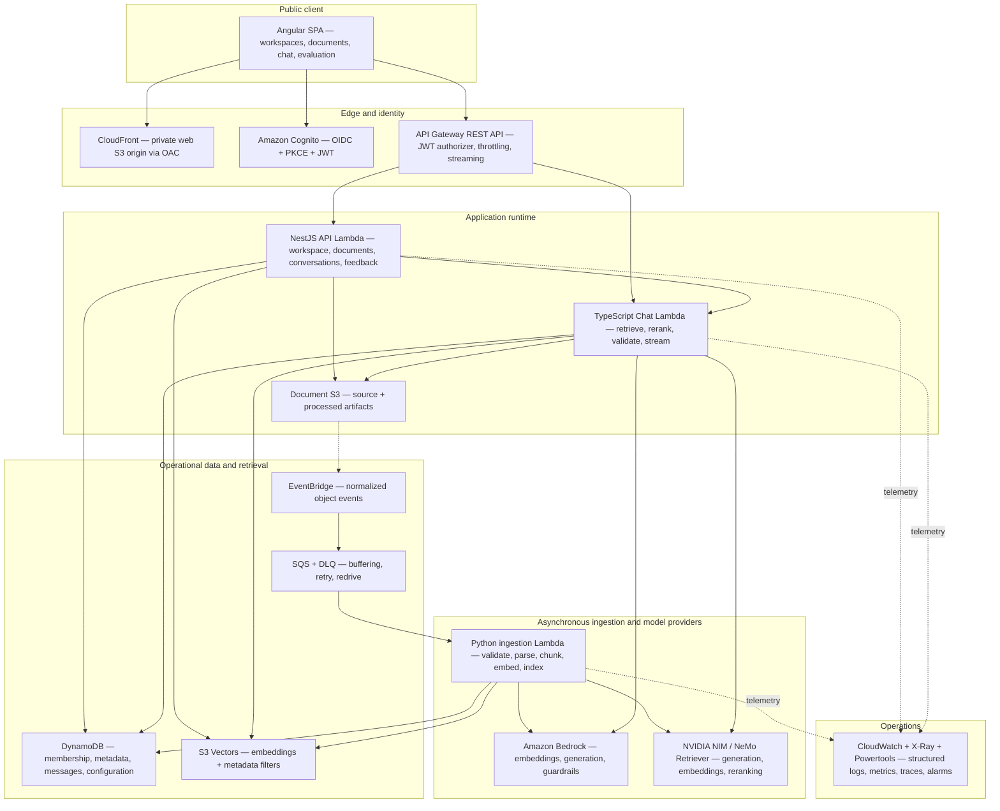

# Architecture

## Product statement

An authenticated engineering knowledge assistant. Users upload technical documents into a
workspace, documents are processed asynchronously, and users ask questions that are answered with
retrieval-augmented generation grounded in the workspace's own content — every claim traceable to a
cited, inspectable source excerpt. When the corpus does not support an answer, the system says so
explicitly rather than inventing one.

See the [source blueprint](../AI_Knowledge_Assistant_Complete_Project_Blueprint.pdf) for the full
detailed specification this project is built from. This document summarizes the parts needed to
navigate the repository; it does not restate every acceptance criterion.

## Project principles

1. **Evidence before fluency.** A polished answer without supporting evidence is a failure.
2. **Authorization before retrieval.** The model never decides what a user is allowed to see.
3. **Version everything.** Documents, chunks, embeddings, prompts, guardrails, models, evaluation
   datasets, and application releases must be identifiable.
4. **At-least-once is normal.** Event-driven processing must tolerate duplicates and retries.
5. **Evaluate changes.** Prompt, retrieval, chunking, and model changes ship only after regression
   evaluation.
6. **Provider abstraction, not provider denial.** Use provider-specific capabilities, but keep the
   orchestration boundary small enough to compare alternatives.
7. **Serverless first, not serverless forever.** Start with Lambda and managed services; define
   measurable conditions for moving long-running workloads to containers.
8. **Public or synthetic content for the portfolio.** Confidential company documents require
   approved accounts, contracts, access controls, and policies — never used here.

## Logical architecture



The browser is an untrusted public client. It receives identity tokens, but never AWS credentials
or model-provider credentials. The application API authorizes every workspace operation, generates
narrowly scoped presigned S3 requests, and owns all resource identifiers. CloudFront reads the web
asset bucket through Origin Access Control rather than a public S3 website origin.

## Component responsibilities

| Component                       | Responsibility                                                             | Must not do                                                               |
| ------------------------------- | -------------------------------------------------------------------------- | ------------------------------------------------------------------------- |
| Angular SPA                     | User experience, local UI state, streaming display, source inspection      | Decide authorization, store provider secrets, construct arbitrary S3 keys |
| Cognito                         | Authentication, token issuance, optional MFA/federation                    | Represent all workspace authorization rules                               |
| API Gateway                     | Routing, JWT authorizer, throttling, request limits, streaming integration | Contain business authorization logic                                      |
| NestJS API Lambda               | Workspaces, membership, documents, conversations, feedback, configuration  | Perform heavy document parsing                                            |
| Chat Lambda                     | Retrieval orchestration, provider invocation, streaming events             | Accept model-selected authorization filters                               |
| Document S3                     | Source files and processed artifacts                                       | Be public, or act as the primary application database                     |
| EventBridge                     | Normalize and route S3 events                                              | Guarantee exactly-once delivery                                           |
| SQS + DLQ                       | Buffer ingestion, absorb spikes, isolate failures                          | Serve as long-term job history                                            |
| Python ingestion worker         | Validate, extract, chunk, embed, index, update status                      | Trust client-provided MIME types or filenames                             |
| DynamoDB                        | Operational state: membership, chunks, messages, configuration             | Store entire large documents in one item                                  |
| S3 Vectors                      | Vector data and retrieval metadata                                         | Become the only authorization control                                     |
| Bedrock                         | Baseline embeddings, generation, and guardrails                            | Receive secrets or unnecessary personal data                              |
| NVIDIA NIM / NeMo Retriever     | Alternative generation, embedding, and reranking                           | Force the application to duplicate orchestration logic                    |
| CloudWatch / X-Ray / Powertools | Logs, metrics, traces, alarms, correlation, idempotency                    | Log raw sensitive content by default                                      |

## Why separate control-plane and streaming functions

The NestJS API is useful for CRUD, validation, authorization, OpenAPI generation, and modular
business logic. The streaming chat response has different characteristics: it is latency
sensitive, holds the invocation open while tokens arrive, needs careful cancellation and timeout
behavior, should have its own concurrency and cost limits, and benefits from a smaller runtime and
dependency set. `apps/chat-stream` is therefore a lightweight Lambda that imports shared domain and
provider packages but does not bootstrap the full NestJS application.

## Trust boundaries

1. **Browser to identity provider.** OIDC Authorization Code with PKCE.
2. **Browser to API.** Validate JWT issuer, audience/client, expiration, and scopes/claims.
3. **API to workspace data.** Load membership server-side and fail closed.
4. **Upload to processing.** Treat the uploaded file as hostile input.
5. **Retrieved content to model.** Treat document text as untrusted data that may contain
   instructions.
6. **Application to external model provider.** Send only the minimum necessary content, using
   managed secrets.
7. **Operations to logs and evaluation artifacts.** Redact or avoid sensitive content.

See [threat-model.md](./threat-model.md) for how each boundary is defended and verified.

## Environment topology

At minimum, separate `dev` and `prod` environments; `stage` is added once the pipeline is stable.
Each environment has its own Cognito resources, S3 buckets, DynamoDB tables, SQS queues/DLQs,
vector indexes, API Gateway stage, model/prompt configuration, KMS keys, and log
groups/alarms/budgets. A production knowledge index is never reused in development.

## Architectural escape hatches

| Move away from the baseline when                                                                                                                   | Natural evolution                                                                                                           |
| -------------------------------------------------------------------------------------------------------------------------------------------------- | --------------------------------------------------------------------------------------------------------------------------- |
| Ingestion regularly approaches the Lambda timeout, needs OCR/native parsing libraries, or one document needs multiple parallel/checkpointed stages | Step Functions orchestrating Lambda and ECS/Fargate tasks, preserving the same job contract                                 |
| Sustained request volume makes cold starts/provisioned concurrency unattractive, or long-lived connections are needed                              | A containerized NestJS service                                                                                              |
| Hybrid lexical+vector search, stricter retrieval latency, rich filtering, or relational joins become essential                                     | OpenSearch Serverless, Aurora PostgreSQL + `pgvector`, or a managed knowledge base, behind the same `VectorStore` interface |

## Repository layout

```
apps/
  web/                 Angular application
  api/                 NestJS control-plane Lambda
  chat-stream/         Lightweight streaming Lambda
  ingestion/           Python ingestion worker (uv)
  evaluation-runner/   Python evaluation jobs and CLI (uv)
packages/
  contracts/           OpenAPI-derived DTOs, error codes, streaming/event shapes
  domain/              State machines and pure business rules
  aws-clients/         Memoized DynamoDB/S3/SQS/Bedrock/Secrets Manager client wrappers
  model-providers/     Bedrock and NVIDIA embedding/generation adapter interfaces
  retrieval/           Vector store and reranker interfaces
  observability/       Structured logger shared across TS services
  testing/             Fake provider implementations for local dev and fast tests
infrastructure/        AWS CDK app: bin/infrastructure.ts + lib/*-stack.ts (§CDK stack plan below)
evaluation/             datasets/, experiments/, reports/
docs/                   this documentation set, including adr/
```

## Angular application plan

Organized by business feature, not technical file type: `core/` (auth, api client, error handling,
telemetry, layout — populated as each lands), `shared/` (reusable components/directives/pipes),
`features/` (workspaces, documents, conversations, chat, evaluations, settings — populated week by
week). Standalone components, signals for local/feature state, zoneless change detection, thin
route-level orchestration components. The route table (`apps/web/src/app/app.routes.ts`) is wired
now using a shared `PlaceholderPage` component so routing stays real and testable while each
feature is built; replace each route's component as that feature lands.

## NestJS control-plane API

Layered as transport (controller, DTO validation) → application (use cases) → domain (state
machines, authorization policy) → infrastructure (DynamoDB, S3, Cognito, provider adapters). All
`/v1/*` endpoints require authentication; every workspace endpoint loads membership server-side and
verifies the required role before touching a resource (`WorkspaceAuthorizer.requireRole`, in
`packages/domain`'s role-comparison helper). `/health/live` and `/health/ready` sit outside the
`/v1` prefix and outside business authorization. The current module set
(`apps/api/src/*/*.module.ts`) mirrors the endpoint groups this API will expose — most are still
empty containers; `HealthModule` is the one with real content, since a liveness check has no
dependency on anything not yet built.

## RAG runtime and model integration

Provider adapters (Bedrock, NVIDIA) implement small, domain-oriented interfaces —
`EmbeddingProvider`/`GenerationProvider` in `packages/model-providers`, `VectorStore`/`Reranker` in
`packages/retrieval` — so the orchestration layer (evidence selection, prompt construction, citation
validation, persistence) never depends on a provider SDK directly, and a provider can be swapped
without rewriting the chat Lambda. `packages/testing` provides deterministic fake implementations
of every interface for local development and unit tests that need no network access.

`apps/chat-stream`'s handler currently validates the request shape and streams a real
`insufficient_evidence` response — correct behavior for "zero evidence gathered," since retrieval
and generation are not wired yet (roadmap Weeks 7-8). This is not a stub that lies about success; it
is the system's own abstention policy applied honestly to its current (empty) capability.

## Infrastructure as code

Seven CDK stacks (`infrastructure/lib/*.ts`), instantiated once per environment in
`infrastructure/bin/infrastructure.ts` with consistent naming (`aka-<environment>-<Stack>`):

| Stack                | Main resources                                                            | Lands       |
| -------------------- | ------------------------------------------------------------------------- | ----------- |
| `EdgeStack`          | Web S3 bucket, CloudFront, OAC, DNS/certificate                           | Week 2      |
| `AuthStack`          | Cognito user pool, app client (PKCE), domain                              | Week 2      |
| `DataStack`          | Document S3, main DynamoDB table, idempotency table, KMS keys, S3 Vectors | Weeks 3-6   |
| `ApiStack`           | API Gateway, NestJS Lambda, chat Lambda, JWT authorizer, throttling       | Weeks 3, 8  |
| `IngestionStack`     | EventBridge rules, SQS + DLQ, ingestion/deletion workers                  | Week 5      |
| `AiStack`            | Bedrock permissions, model/guardrail configuration, NVIDIA secret refs    | Weeks 7, 14 |
| `ObservabilityStack` | Dashboards, alarms, log retention, budget notifications                   | Week 12     |

All seven stacks exist today and synthesize successfully (`pnpm cdk synth`); they are intentionally
resource-empty until the week they're built, the same way the NestJS module set is intentionally
empty until its controllers/services land.

## Key design decisions

See [docs/adr/](./adr/) for the full record. Summary:

| Decision                | Chosen approach                            | Revisit when                                                                                                       |
| ----------------------- | ------------------------------------------ | ------------------------------------------------------------------------------------------------------------------ |
| API hosting             | Lambda                                     | Sustained traffic, large framework cold starts, or long-lived connections dominate cost/latency                    |
| Ingestion compute       | Lambda                                     | Files regularly exceed Lambda time/memory/package constraints; move heavy parsing to ECS/Fargate or Step Functions |
| Vector store            | S3 Vectors                                 | Hybrid search, very low latency, or relational joins are required                                                  |
| Authentication          | Cognito + Authorization Code with PKCE     | Enterprise SSO becomes a requirement                                                                               |
| Workspace authorization | Application membership records in DynamoDB | Regulatory isolation requires account-, pool-, or index-level separation                                           |
| LLM baseline            | Bedrock                                    | A provider comparison demonstrates better quality, cost, latency, or deployment control elsewhere                  |
| RAG implementation      | Custom first, managed comparison second    | The custom pipeline is stable and evaluated                                                                        |
| Monorepo                | One repository, shared contracts           | Teams and release cadence become sufficiently independent to justify separation                                    |

## Next reading

- [threat-model.md](./threat-model.md) — threats, controls, and verification per boundary
- [evaluation-strategy.md](./evaluation-strategy.md) — how RAG quality is measured and gated
- [operations-runbook.md](./operations-runbook.md) — structured logging, alarms, and incident runbooks
- [adr/](./adr/) — the decisions behind this architecture, with context and revisit triggers
